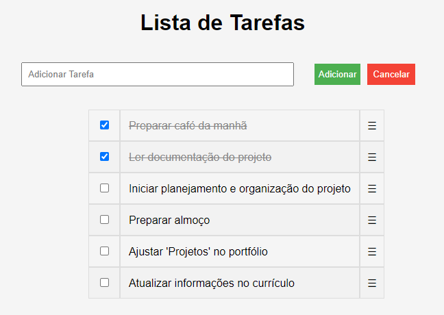

<h1 align="center">✔️ Lista de tarefas ✔️</h1>

    
  

## Descrição do Projeto

O projeto "Lista de Tarefas" foi proposto pela EBAC a ser desenvolvido utilizando Jquery.
Uma aplicação web onde pode ser inserido provisoriamente uma lista de tarefas a serem realizadas, e marcadas como concluídas atraves do checkbox.

### [Visite o projeto](https:)

 

## Tópicos do Projeto

- Inserção da tarefa a ser feita através de input e botão 'adicionar' ou 'cancelar'.
- Tabela incrementavel de acordo com os dados inseridos.
- Checkbox para marcar tarefas realizadas.

 
<h2 align="center"> Desenvolvido por:
</h2>

<h3 align="center"> Renata Ribeiro 

</h3>
  
